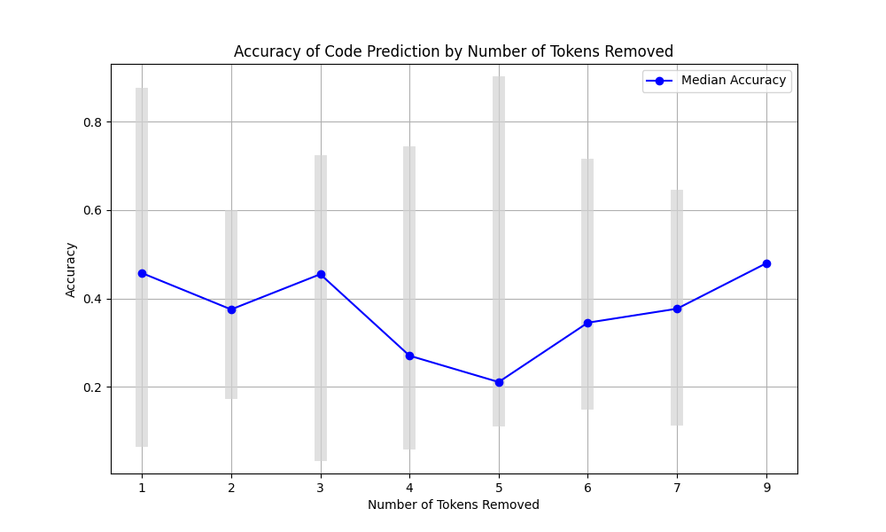

# Evaluation of Current AI Code Completion

The goal of this experiment was to find out how accurate current AI code completion tools are able to predict code and finish uncompleted code functions. 

I decided that testing functions instead of entire files would be better since it provides a more accurate description of what the code should do.

For this test, I am using the model _TinyStarCoderPy_ from [tiny_starcoder](https://huggingface.co/bigcode/tiny_starcoder_py).

# 1. Generating the Dataset

The first stage for this experiment is to generate some code samples. I created a simple mathematics library with 30 examples of functions, ranging from simple one line definitions to increasingly complex bodies. This will be used for the initial test, since its size is small and the function does not require any knowledge of third-party libraries. The result of the function is also quite straightforward as it not ambitious. The library looks something like this:

```python
def add(x, y):
    """Return the sum of x and y."""
    return x + y

def power(base, exponent):
    """Return base raised to the power of exponent."""
    result = 1
    for _ in range(exponent):
        result *= base
    return result

def merge_sorted_lists(list1, list2):
    """Return a new sorted list by merging two sorted lists."""
    merged = []
    i, j = 0, 0
    while i < len(list1) and j < len(list2):
        if list1[i] < list2[j]:
            merged.append(list1[i])
            i += 1
        else:
            merged.append(list2[j])
            j += 1
    merged.extend(list1[i:])
    merged.extend(list2[j:])
    return merged


# and so on
# ...
```

In order to use this code for testing the predictions of the _TinyStarCoderPy_ I needed to generate some examples of code with missing text and try to see if the AI can accurately predict it.

To do this, I wrote a script called `generate_dataset.py` which extracts all the functions in a folder and returns a random selection (of a maximum size) of them with some missing code.

The result is a `JSON` dataset that looks something like this:
```json
[
    {
        "file": "C:\\Programming\\Python\\code-completion-evaluation\\math\\main.py",
        "contents": [
            {
                "header": "def quicksort(arr):",
                "docstring": "\"\"\"Return a sorted list using the quicksort algorithm.\"\"\"",
                "body": {
                    "bodyBefore": "if len(arr) <= 1:\n        return arr\n    pivot = arr[len(", // ...,
                    "prefix": "    return quicksort(left) +",
                    "removedWords": " middle + quicksort(right)",
                    "bodyAfter": "",
                    "numWordsRemoved": 3
                }
            },
        // and so on
        // ...
          ],
      // ...
    }
```
With the datasets generated, I was now able to run _TinyStarCoderPy_'s prediction on it.

# 2. Text Prediction

I wrote a class called `TextGenerator` in `tiny_starcoder.py`, which contained the method `def predict_text(self, prompt, max_length=50)` that returns the AI's prediction. The prediction is concatenated onto the prompt and returned.

Using this I create a script called `pred_accuracy_by_size.py` which uses the `predict_text` function on the dataset.

## Evaluating the AI's response

We now need to decide on how we are going to decide whether the AI's response is good or not. We can try to use several automatic metrics, however before this, I first needed to get a reference by manually checking each response and self-evaluating whether I think it is a correct response or not. 

I ran the script and counted how many times the AI either accurately predicted it, or generated irrelevant code.

I was a bit surprised with the result. The AI was able to correctly insert code as you would expect, even adding documentation:
```python
def multiply(x, y):
    # The AI's response starts from the next line
    """Return the product of x and y."""
    return x * y
```

The function is as basic as it gets, but nevertheless, it was a correct prediction.
However, for a surprising number of times, the AI responded with unusual suggestions.

Some noticeable examples include:
```python
# A strange edge case for add()
def add(x, y):
    # The AI's response starts from the next line
    """Return the sum of x and y."""
    return 0 if x == y else x + y

# Over complicating subtracting two numbers
def subtract(x, y):
    # The AI's response starts from the next line
    """Return the difference of x and y."""
    return np.abs(x - y)

# A random number?
def calculate_mean(numbers):
    total = sum(numbers)
    count = len(numbers)
    return total / # The AI's response starts from the next line
        1000000000000000000000000000000000000000000000000000000000000

# Pseudocode?
def merge_dictionaries(dict1, dict2):
    merged = dict1.copy()
    for # The AI's response starts from the next line
        merges two dictionaries
        # AI's response finishes
        if key in merged:
            merged[key] += value  # Sum values if the key exists
        else:
            merged[key] = value
    return merged
```

Surprisingly, I think that even ChatGPT could have down a better job.

With the 30 examples from `useful_math_dataset.json`, the result were:

| No. Words to Predict | No. Successful Predictions | No. Incorrect Predictions | Total | Accuracy |
|----------------------|----------------------------|---------------------------|-------|----------|
| 2                    | 4                          | 0                         | 4     | 1.00     |
| 3                    | 2                          | 4                         | 6     | 0.33     |
| 4                    | 4                          | 5                         | 9     | 0.44     |
| 5                    | 1                          | 3                         | 4     | 0.25     |
| 6                    | 2                          | 2                         | 4     | 0.50     |
| 7                    | 1                          | 1                         | 2     | 0.50     |
| 8                    | 0                          | 0                         | 0     | 0.00     |
| 9                    | 1                          | 0                         | 1     | 1.00     |
| Total                | 15                         | 15                        | 30    | 0.50     |

[*] _Words_ here meaning consecutive alphanumeric characters separated by either whitespace, parentheses or quotation marks. Essentially tokens.

Results with a higher number of tests are more accurate, but we can see that it is about a **50-50 chance** whether the AI could auto-complete with a relevant suggestion.

In order to achieve a more precise result, we need to run the tests on more examples. We can do this with automation.

# 3. Automating the Evaluation of the AI

Performing the experiment with manual reviews allowed use to figure out approximately how good the AI is. We can then run different automatic metric to access the result and find out which one produces an output that is close to it. 

If it is **too low**, then the metric is being **too harsh** and if it is **too high**, then metric is being **too lenient**. 

For the metrics, I decided to use the following 4:
1. **Exact Match**: Comparing using the `==` operator.
2. **chrf**: Compares character-level n-grams focusing on precision, recall, and F-score.
3. **Levenshtein Distance**: Measures the minimum number of edits (insertions, deletions, or substitutions) needed to transform one string into another.
4. **Function Testing**: Comparing the code, based purely on its behaviour. This can be achieved by running the original code vs the predicted code and comparing results. If the generated code does not compile, then it treats it as an accuracy of 0.

I decided to write code for these metrics in `pred_accuracy_by_size.py` and see what they thought of the AI's response for the same dataset as before.

Here are the responses, as well as the time it took:

| Metric             | AI's Accuracy | Avg. Time Taken to Run (per test) (ms) |
|--------------------|---------------|----------------------------------------|
| Exact Match        | 0.143         | <1                                     |
| chrf               | 0.365         | <1                                     |
| Levenshtein        | 0.726         | 9860                                   |
| Functional Testing | n/a           | n/a                                    |

1. **Exact Match** worked by checking whether the correct answer was `in` the generated text, rather than just a simple equality to give it a bit more tolerance.
2. **chf** was achieved by using `pairwise_chrf()` function from the library [fastchrf](https://pypi.org/project/fastchrf/).
3. **Levenshtein** distance only works when the string being compared to are the same length. For this, I decided to split the predicted text up into the same size as the correct text and use the best match. This however is a too slow process to practically run, although it resulted in having the highest _"AI's accuracy"_ rating compared to all of them.
4. I did not do **Functional Testing** **here** because it is not best here. It only works when the functionality of the function can be fully described with units tests, hence can only test code with a test suite. 
      * Since this quite limits the code that we can run it on, I will do it in a **later section**, with sample code with functions that has been specially written to be mathematically pure and have a test suite.

Out of all the metrics here, the one that reflects the true accuracy the most is **chrf**. Therefore, I will use **chrf** as the metric and run the AI code completion on a large dataset, consisting with common code, code working with third-party libraries, graphical-user interfaces, game development, etc.

## Testing the AI on a Large Dataset

The combined total from the datasets in `dataset/` consist of 179 examples of functions with missing code.

After testing the AI with functions consisting of varying numbers of missing words, the results with **chrf** are as follows:



The vertical bars represent the **min** and **max** score of **chrf** for that category (9 only had one sample).

The Overall Average Accuracy was **0.425**, which is not too far off from the sample (human-measured) average of **0.5**.

Surprisingly, I thought that the more missing words, the less likely the AI was to predict them, however it does not seem to be the case. Is it the AI, or is it the metric that just commonly results in a score of 0.5?

# 4. Testing the Code Written by the AI

I was not satisfied by the results and I wanted to see if the AI could do better if it wrote the function entire from scratch, rather than comparing a single line of code. Maybe the AI thinks differently to humans, but nevertheless produces overall code with the same functionality.

To do this, I created a new library called...