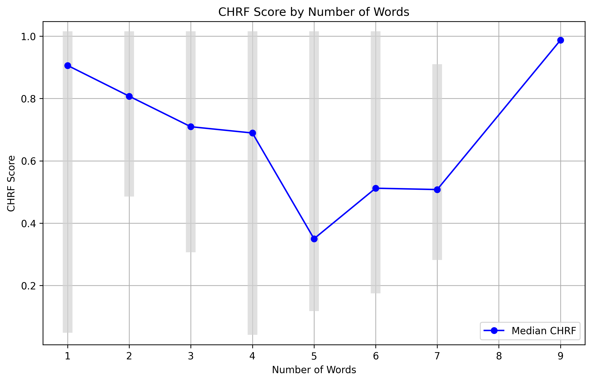
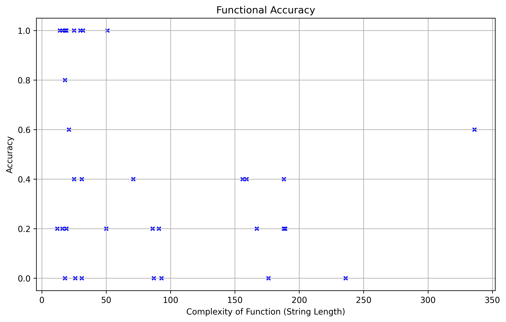
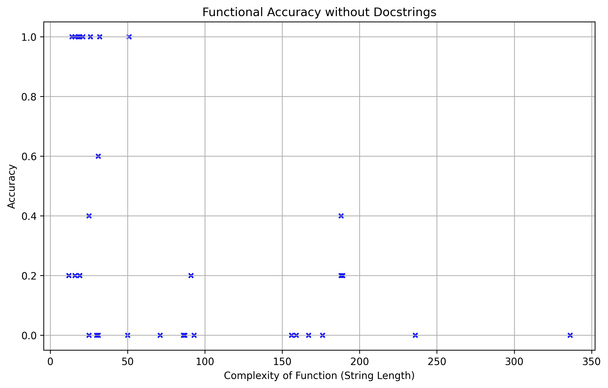

# Evaluation of Current AI Code Completion

The goal of this experiment was to find out how accurate current AI code completion tools are able to predict code and finish uncompleted code functions. 

I decided that testing functions instead of entire files would be better since it provides a more accurate description of what the code should do.

For this test, I am using the model _TinyStarCoderPy_ from [tiny_starcoder](https://huggingface.co/bigcode/tiny_starcoder_py).

# 1. Generating the Dataset

The first stage for this experiment is to generate some code samples. I created a simple mathematics library with 30 examples of functions, ranging from simple one line definitions to increasingly complex bodies. This will be used for the initial test, since its size is small and the function does not require any knowledge of third-party libraries. The result of the function is also quite straightforward as it not ambitious. The library looks something like this:

```python
def add(x, y):
    """Return the sum of x and y."""
    return x + y

def power(base, exponent):
    """Return base raised to the power of exponent."""
    result = 1
    for _ in range(exponent):
        result *= base
    return result

def merge_sorted_lists(list1, list2):
    """Return a new sorted list by merging two sorted lists."""
    merged = []
    i, j = 0, 0
    while i < len(list1) and j < len(list2):
        if list1[i] < list2[j]:
            merged.append(list1[i])
            i += 1
        else:
            merged.append(list2[j])
            j += 1
    merged.extend(list1[i:])
    merged.extend(list2[j:])
    return merged


# and so on
# ...
```

In order to use this code for testing the predictions of the _TinyStarCoderPy_ I needed to generate some examples of code with missing text and try to see if the AI can accurately predict it.

To do this, I wrote a script called `generate_dataset.py` which extracts all the functions in a folder and returns a random selection (of a maximum size) of them with some missing code.

The result is a `JSON` dataset that looks something like this:
```json
[
    {
        "file": "C:\\Programming\\Python\\code-completion-evaluation\\math\\main.py",
        "contents": [
            {
                "header": "def quicksort(arr):",
                "docstring": "\"\"\"Return a sorted list using the quicksort algorithm.\"\"\"",
                "body": {
                    "bodyBefore": "if len(arr) <= 1:\n        return arr\n    pivot = arr[len(", // ...,
                    "prefix": "    return quicksort(left) +",
                    "removedWords": " middle + quicksort(right)",
                    "bodyAfter": "",
                    "numWordsRemoved": 3
                }
            },
        // and so on
        // ...
          ],
      // ...
    }
```
With the datasets generated, I was now able to run _TinyStarCoderPy_'s prediction on it.

# 2. Text Prediction

I wrote a class called `TextGenerator` in `tiny_starcoder.py`, which contained the method `def predict_text(self, prompt, max_length=50)` that returns the AI's prediction. The prediction is concatenated onto the prompt and returned.

Using this I create a script called `pred_accuracy_by_size.py` which uses the `predict_text` function on the dataset.

## Evaluating the AI's response

We now need to decide on how we are going to decide whether the AI's response is good or not. We can try to use several automatic metrics, however before this, I first needed to get a reference by manually checking each response and self-evaluating whether I think it is a correct response or not. 

I ran the script and counted how many times the AI either accurately predicted it, or generated irrelevant code.

I was a bit surprised with the result. The AI was able to correctly insert code as you would expect, even adding documentation:
```python
def multiply(x, y):
    # The AI's response starts from the next line
    """Return the product of x and y."""
    return x * y
```

The function is as basic as it gets, but nevertheless, it was a correct prediction.
However, for a surprising number of times, the AI responded with unusual suggestions.

Some noticeable examples include:
```python
# A strange edge case for add()
def add(x, y):
    # The AI's response starts from the next line
    """Return the sum of x and y."""
    return 0 if x == y else x + y

# Over complicating subtracting two numbers
def subtract(x, y):
    # The AI's response starts from the next line
    """Return the difference of x and y."""
    return np.abs(x - y)

# A random number?
def calculate_mean(numbers):
    total = sum(numbers)
    count = len(numbers)
    return total / # The AI's response starts from the next line
        1000000000000000000000000000000000000000000000000000000000000

# Pseudocode?
def merge_dictionaries(dict1, dict2):
    merged = dict1.copy()
    for # The AI's response starts from the next line
        merges two dictionaries
        # AI's response finishes
        if key in merged:
            merged[key] += value  # Sum values if the key exists
        else:
            merged[key] = value
    return merged
```

Surprisingly, I think that even ChatGPT could have down a better job.

With the 30 examples from `useful_math_dataset.json`, the result were:

| No. Words to Predict | No. Successful Predictions | No. Incorrect Predictions | Total | Accuracy |
|----------------------|----------------------------|---------------------------|-------|----------|
| 2                    | 4                          | 0                         | 4     | 1.00     |
| 3                    | 2                          | 4                         | 6     | 0.33     |
| 4                    | 4                          | 5                         | 9     | 0.44     |
| 5                    | 1                          | 3                         | 4     | 0.25     |
| 6                    | 2                          | 2                         | 4     | 0.50     |
| 7                    | 1                          | 1                         | 2     | 0.50     |
| 8                    | 0                          | 0                         | 0     | 0.00     |
| 9                    | 1                          | 0                         | 1     | 1.00     |
| Total                | 15                         | 15                        | 30    | 0.50     |

[*] _Words_ here meaning consecutive alphanumeric characters separated by either whitespace, parentheses or quotation marks. Essentially tokens.

Results with a higher number of tests are more accurate, but we can see that it is about a **50-50 chance** whether the AI could auto-complete with a relevant suggestion.

In order to achieve a more precise result, we need to run the tests on more examples. We can do this with automation.

# 3. Automating the Evaluation of the AI

Performing the experiment with manual reviews allowed use to figure out approximately how good the AI is. We can then run different automatic metric to access the result and find out which one produces an output that is close to it. 

If it is **too low**, then the metric is being **too harsh** and if it is **too high**, then metric is being **too lenient**. 

For the metrics, I decided to use the following 4:
1. **Exact Match**: Comparing using the `==` operator.
2. **chrf**: Compares character-level n-grams focusing on precision, recall, and F-score.
3. **Levenshtein Distance**: Measures the minimum number of edits (insertions, deletions, or substitutions) needed to transform one string into another.
4. **Jaro Distance**: A measure of edit distance between two strings as a value between 0 and 1.
5. **Function Testing**: Comparing the code, based purely on its behaviour. This can be achieved by running the original code vs the predicted code and comparing results. If the generated code does not compile, then it treats it as an accuracy of 0.

I decided to write code for these metrics in `pred_accuracy_by_size.py` and see what they thought of the AI's response for the same dataset as before.

Here are the responses, as well as the time it took:

| Metric             | AI's Accuracy |
|--------------------|---------------|
| Exact Match        | 0.139474      | 
| chrf               | 0.754016      |
| Levenshtein        | 0.845843      | 
| Jaro               | 0.893907      |
| Functional Testing | n/a           |

1. **Exact Match** worked by checking whether the correct answer was `in` the generated text, rather than just a simple equality to give it a bit more tolerance.
2. **chf** was achieved by using `pairwise_chrf()` function from the library [fastchrf](https://pypi.org/project/fastchrf/).
3. **Levenshtein** distance and **Jaro** was achieved by using the `distance()` and `jaro()` function respectively from the library [Levenshtein](https://pypi.org/project/python-Levenshtein/)
5. I did not do **Functional Testing** **here** because it is not best here. It only works when the functionality of the function can be fully described with units tests, hence can only test code with a test suite. 
      * Since this quite limits the code that we can run it on, I will do it in a **later section**, with sample code with functions that has been specially written to be mathematically pure and have a test suite.

Out of all the metrics here, the one that is the closest to the true accuracy is **chrf**. Therefore, I will use **chrf** as the metric and run the AI code completion on a large dataset, consisting with common code, code working with third-party libraries, graphical-user interfaces, game development, etc.

## Testing the AI on a Large Dataset

The combined total from the datasets in `dataset/missing_line_datasets  ` consist of 179 examples of functions with missing code.

After testing the AI with functions consisting of varying numbers of missing words, the results with **chrf** are as follows:



The vertical bars represent the **min** and **max** score of **chrf** for that category (9 only had one sample).

The Overall Average Accuracy was **0.724016**, which is higher than the sample (human-measured) average of **0.5**.

Surprisingly, I thought that the more missing words, the less likely the AI was to predict them, however it does not seem to be the case. Perhaps the metric is too generous with its scoring.

# 4. Testing the Code Written by the AI

I was not satisfied by the results and I wanted to see if the AI could do better if it wrote the function entire from scratch, rather than comparing a single line of code. Maybe the AI thinks differently to humans, but nevertheless produces overall code with the same functionality.

## Preparing the Data

To do this, I created a new library called `string_manipulation.py` which contains 36 functions related to string processing. With it, I also created a test suite called `string_manipulation_test.py`, which testing every single function with a unit test consisting of several test cases.

I processed this library into a new dataset using a new script I made called `generate_funcs_with_test.py`. This reads the sources files and looks for unit tests that pair up with its corresponding function.

The result look something like this:

```json
[
  {
    "file": "C:\\...\\string\\src\\string_manipulation.py",
    "contents": [
      {
        "header": "def reverse_string(s):",
        "docstring": "\"\"\"Returns the reversed string.\"\"\"",
        "body": "return s[::-1]",
        "test": "self.assertEqual(reverse_string(\"hello\"), \"olleh\")\n    self.assertEq" // ...
      }
       // More functions
      // ...
    ]
  }
]
```

`func["test"]` stores the body of the unit test function as a string. Ideally, the best approach would be to store inputs to the function and their expected output, however for now this is a sufficient approach.

## Testing the AI's Response
### Setup

Next, I created a file called `func_gen_accuracy.py`, which will test the AI generated version of the entire function against the expected results from the unit tests.

To get the Python code evalution working, I first created a dummy tester, which just tested the function using the original function body.

This can be found in function `testFunc()`. The string to be executed looks something like this:
```python
import unittest
class TestFunc(unittest.TestCase):
    def test_myTest(self):
        def reverse_string(s):
            return s[::-1]
        self.assertEqual(reverse_string("hello"), "olleh")
        self.assertEqual(reverse_string(""), "")
        self.assertEqual(reverse_string("a"), "a")
        self.assertEqual(reverse_string("12345"), "54321")
```

Evaluating this tells us how the function performs. I ran the test on all the examples and as expected I got this:
```commandline
C:\...\string\src\string_manipulation.py
Tests passed: 36
Number of tests: 36
```

And when I broke the test, (both logically and syntactically), I got fewer test passing.

Now, all I had to do was replace the function body, the response made from the AI. I rewrote the code to make the function treat each assertion as a different test, so we could return the percentage of passed tests, rather than just 0 and 1.

### Results
After running the code on all 36 examples and plotted the results on a graph, the results are as follows:



The overall accuracy was 0.464. It seemed that the AI was quite good when the functions were of a small size (< 60 characters). When it got larger, the accuracy went down and there were no results with perfect accuracy.

Even though, it achieved a score of 1.0 for a lot of short functions, it had even more functions with < 1.0. I thought that the AI would be able to easily generate them, but that does not seem the case.

The AI is only slightly better at generating entire functions as opposed to auto completing individual lines.

### Reducing the Input Data

When running the test, I gave the AI both the header of the function and a docstring explaining what the function does. I thought it would be interesting to see what happens if you remove the docstring and only let the AI base its decision of the function name and arguments. Can it predict what the function does?

I repeated the experiment, removing the docstrings from the input to the model and repeated the experiment. The results are as follows:



The overall accuracy was 0.408. This is a smaller value than previously, however looking at the graph, the result seem to be closer together. There are more 1.0 results for small functions of size < 60, and more 0.0 results overall. It looks like the AI could either entirely understand what the function was supposed to do and can correctly implement it, or it had no idea or completely generated an incorrect function.

# 5. Conclusions of the Experiment

In conclusion, the evaluation of the TinyStarCoderPy AI code completion tool revealed a mixed performance in predicting and generating code.

1. The initial manual assessment showed that although the AI could successfully complete simple functions with a very high accuracy score of 100%, in many cases it also produced unexpected and irrelevant outputs when working with more complex examples.
There did not seem to be an exact link between number of missing words and its accuracy, resulting in an overall accuracy of approximately 50% in the initial test.

2. Automating the evaluation process using metrics such as Exact Match, chrf and Levenshtein Distance could allow use to test the AI with many more examples than before.
Among these, chrf seem the most reliable indicator of accuracy, with results that were the most similar with the manual (human) assessments, but still quite high.
When tested on with a larger dataset, the AI produced an average accuracy of 72.4%, suggesting that sometimes it could produce useful results, the code it outputed was not perfect, particularly when generating code when working with more complex code.

3. A second test, consisted the generation of entire functions, rather than finishing lines, resulted in an overall accuracy of 40.8% and a higher 46.4% when help was provided to the AI in the form of function documentation.
The AI tended to do better with smaller, more straightforward functions, however as complexity increased, the AI's performance tended to decline, and it was not able to produce correct functions. 

Overall, these results demonstrate the need for ongoing improvements on AI code completion tools, in particularly in handling harder coding tasks. The AI was quite good at generating similar looking code compared to the correct code, however when it was compared against functionality, the results were not very good. 

Future work could involve expanding the dataset and enhancing the AI to improve it ability to predict and generate relevant code more reliably. It would be interesting to run this test using a different AI model, such as GPT and see if it can do better than _TinyStarCoderPy_.